#Beautify :heart:

An iOS app written entirely in Swift, which let users design their own interface. 
So basically, what this app does is that it lets a user play with different color combinations by dynamically modifying RGB
values through a wheel. User can change the color of the font too, by triggering the switch to lock the background. 
In short, a user can make the interface of his own choice :yum:

##Screenshots :movie_camera:
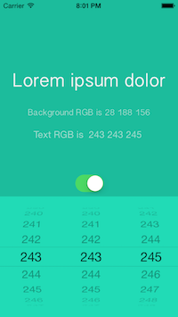 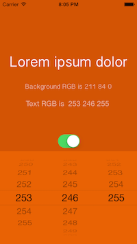 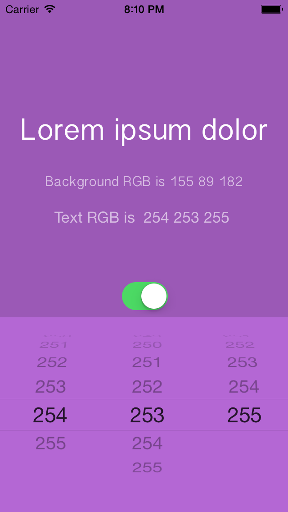
 
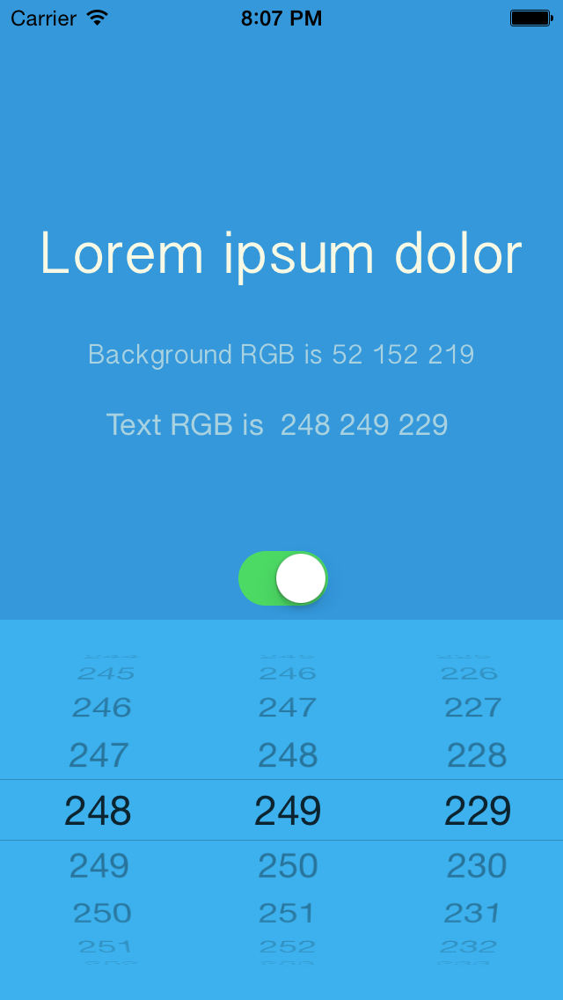 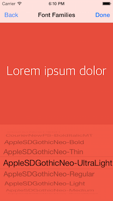 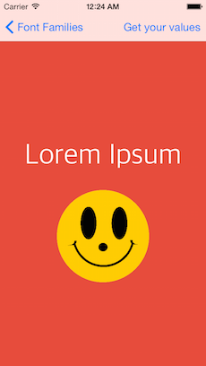  
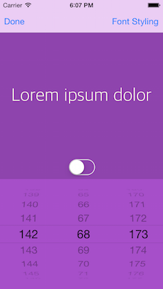  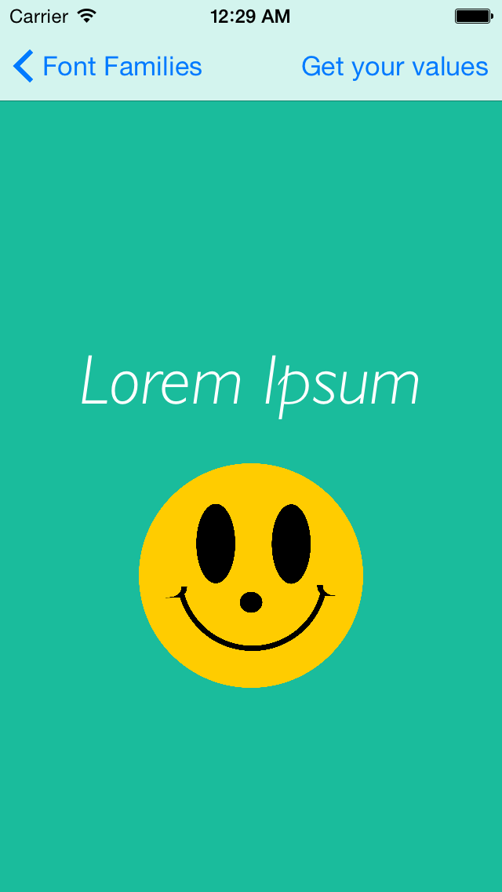  
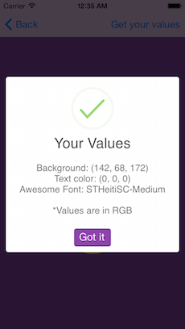 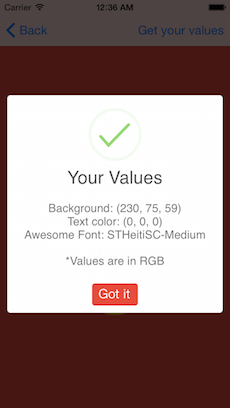 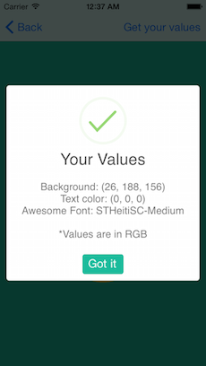

##Features:
- [x] [Flat] (https://gist.githubusercontent.com/wildlyinaccurate/5137255/raw/ae831aaae8676ba5d7f9cc0fe74cb248562d598c/flat-ui-colours.txt) background coloring variations
- [x] Font color variations
- [x] RGB representations of each variation
- [x] Dynamic variations in the Font Family
- [x] Variations in the Font Style
- [x] Default templates
- [ ] Final animated result when Done

---
Compiled on Xcode 6.1, Optimised both for iPhones and iPads running iOS 7 or later :yum:
